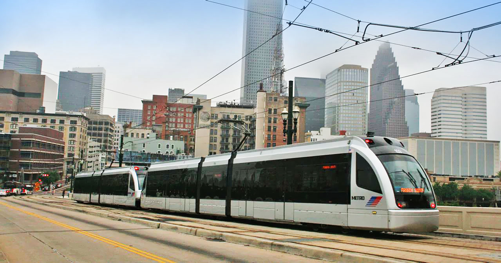
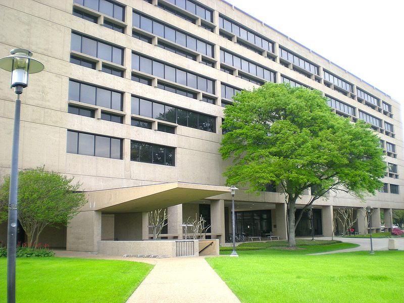

## Today

- What is government? What is politics?
- Top Hat: experiences with government
- Canvas, Inquizitives, and Top Hat overview
- Questions

# Why This Matters

## Why This Matters

::: {.custom-style style="font-size: 65px;"}
By the end of today you will be able to explain why government is different from every other organization in the way it gets things done.
:::

## The Core Question

::: {.custom-style style="font-size: 70px;"}
What makes government different from every other group of people who try to get things done?
:::

## Before You Walked Onto Campus

::: {.custom-style style="font-size: 70px;"}
Before stepping on the campus today, what was the last time that politics made a difference in your life?
:::

# A Word on Words

## Government

- The specific group of people in charge right now
- The enduring institution or organization we call government

## State

- International: State = independent country
- United States: State = one of the 50 states (including Texas)
- Political Science: State = government

## Politics

The process of making collective decisions in the context of the state or government

# What Do Most People Think Politics Is?

## What Do Most People Think Politics Is?

- Expensive or involves large amounts of money
- Distant
- Involves politicians or campaigns
- Involves voting or decision making
- Involves rights
- National borders
- Controversial

## What Is Politics: State and Local

{width="49%"}

## What Is Politics: Federal, State and Local

{width="49%"}

## What Is Politics: Federal, State and Local

{width="49%"}

## What Politics Actually Is

- Not distant
- Immediate, right here
- Touches everything
- Direct impacts are constant
- Involves all of us
- It can be expensive, but it is not always about money

# Politics Is Powerful

## Politics Is Powerful

- Immense power to achieve good ends
- Immense power to do incredible harm

## Politics Is Powerful

::: {.custom-style style="font-size: 3em;"}
Why does politics have such power to cause harm?
:::

## Politics Is Powerful

{width="55%"}

## Politics Is Powerful

{width="55%"}

## Power

::: {.custom-style style="font-size: 90px;"}
Power
:::

# Collective Action

## What Does Government Do?

::: {.custom-style style="font-size: 70px;"}
These are all examples of *collective action* — organized action by a group of people to achieve a common goal.
:::

## What Makes Government Different?

::: {.custom-style style="font-size: 65px;"}
What makes government or The State different from other organizations? Is collective action unique to government?
:::

# Other Organizations

## Other Organizations - Group 1

- Family
- Church
- Community organizations (voluntary)
- Charities
- Businesses — The Market

## Other Organizations — Group 2

- Organized crime
- Vigilantes
- Terrorists

## Key Questions

- For Group 1 organizations: How can they enforce their rules?

- For Group 2 organizations: Who are they responsible to, and how do we view their use of force?

# The State / Government

## What Is Government?

::: {.custom-style style="font-size: 55px;"}
The organized coercive use of physical (violent) force that is commonly accepted as legitimate
:::

## Key terms in the definition

- Organized
- Coercive
- Physical (violent) force
- Legitimate

## Organized

Not random individuals acting alone.

Structure, roles, continuity — an institution that outlasts any one person in office.

## Coercive

Not a request. Not a suggestion.

Compliance is backed by the ability to compel — including against your will.

## Physical (violent) force

Ultimately rooted in physical power: police, courts, prisons, military.

Fines and orders matter because physical enforcement stands behind them.

## Legitimate

Commonly accepted as rightful — by enough people that the system holds.

Same force without legitimacy is crime, vigilantism, or terror — not government.

## Putting it together

::: {.custom-style style="font-size: 55px;"}
Government = organized + coercive + physical force + legitimacy
:::

That combination is what other organizations lack.

## What Is Politics?

::: {.custom-style style="font-size: 65px;"}
Politics is the process of making collective decisions in the context of...
:::

## What Is Politics?

::: {.custom-style style="font-size: 65px;"}
Politics is the process of making collective decisions in the context of the State or government.
:::

## The Difference

These organizations all engage in collective action, but lack one thing the state has:

- Family
- Church
- Community organizations (voluntary)
- Charities
- Businesses — The Market

**Coercive use of physical force treated as legitimate**

## Two Spheres

**Voluntary Sphere**  
Family, church, market, charities...

**Coercive Sphere**  
The State / government

## Politics Is About

Making collective decisions in **the Coercive Sphere**

---

# Top Hat — text bank (remove or hide for live deck)

## Text bank: Government vs other organizations

Government is the organized coercive use of physical (violent) force that is commonly accepted as legitimate. That is what distinguishes it from family, churches, businesses, charities, and community groups, which rely mainly on voluntary compliance, social pressure, exit, or market incentives. Groups that use force without legitimacy (organized crime, vigilantes, terrorists) are not accepted as government. Politics is the process of making collective decisions inside that coercive sphere — not only campaigns and elections, and not only distant national headlines. Local roads, transit, campus rules, and public works are politics too.

## Top Hat questions (auto-scored)

**T/F:** Government is defined in this course as the organized coercive use of physical force that is commonly accepted as legitimate.  
*Answer: True*

**T/F:** Politics only happens in Washington, D.C., or Austin during election years.  
*Answer: False*

**Multiple choice:** Which element of the definition separates government from a criminal gang that also uses force?  
A) Organized  
B) Coercive  
C) Physical force  
D) Legitimacy (commonly accepted as rightful)  
*Answer: D*

**Multiple answer:** Which of the following are usually in the *voluntary* sphere?  
A) A church congregation  
B) The Houston police enforcing a city ordinance  
C) A private business selling groceries  
D) A charity food bank  
*Answers: A, C, D*

**Multiple choice:** What do family, church, market firms, and charities lack that government has?  
A) Collective action  
B) Rules  
C) Organized coercive physical force treated as legitimate  
D) Leaders  
*Answer: C*

**Likert (survey):** Before today, how often did you think of local services (roads, Metro, campus rules) as "politics"?  
1 = Almost never … 5 = Almost always

---

# Canvas, Inquizitives, and Top Hat

## Systems overview (live walkthrough)

- Canvas Modules (especially Module 0)
- Textbook / Inquizitives access
- Top Hat: always enter through the **Canvas** course link

This is a placeholder slide — open the live systems and walk through.

# Next Lecture & Reminders

## Next class (August 31 / September 1): Basic Ethics

Come ready to answer *your own* versions of these questions. We will start with them. Legal answers are not what we are after.

- What are ethically appropriate uses of physical force (violence)?
- How do you (or how should you) make ethical decisions?
- If you must decide something that affects others' lives or property, how do you tell right from wrong when the law is silent?

## Upcoming due dates

- **Module 0 due September 9, 2026 (ORD)** — book + Top Hat registration included; avoid drop
- Keep Inquizitives moving; do not wait until Module deadlines

## Authorship and License

Do not submit to Quizlet, Chegg, Coursehero, or similar commercial sites.

- Author: Tom Hanna
- Website: [tomhanna.me](https://tom-hanna.org/)
- License: [CC BY-NC-SA 4.0](http://creativecommons.org/licenses/by-nc-sa/4.0/)

