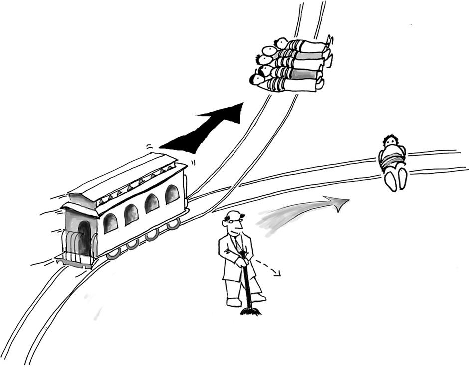
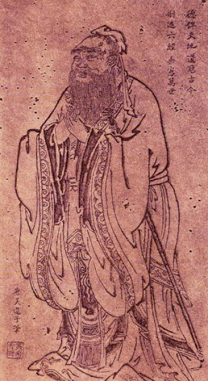

## Today

- Basic ethics
- Top Hat: standards, trolley, reciprocity

# Why This Matters

## Why This Matters

::: {.custom-style style="font-size: 65px;"}
By the end of today you will be able to state your own standard for when force is ethically acceptable — and apply it to government.
:::

## Bridge from last time

- Government is the organized coercive use of physical force commonly accepted as legitimate.

- So ethics is not optional. It is the point.

## Purpose

- Explore together — not a lecture of final answers
- A few terms you should know
- Your disagreement is welcome

# The Trolley Problem

## The Trolley Problem

{width="70%"}

## Utility

::: {.custom-style style="font-size: 90px;"}
Utility
:::

## Omission vs Commission

::: {.custom-style style="font-size: 80px;"}
Omission vs Commission
:::

## Ends and Means

::: {.custom-style style="font-size: 90px;"}
Ends and Means
:::

## Rhetorical prompt

Would you pull the lever?

Does the ratio matter — 5 to 1, 500 to 1, billions to 1?

# Reciprocity

## Reciprocity

::: {.custom-style style="font-size: 90px;"}
The Golden Rule
:::

## Buddha

:::: {.columns}
::: {.column width="35%"}
.jpeg){width="100%"}
:::
::: {.column width="65%"}
> Hurt not others in ways that you yourself would find hurtful.

— Attributed to the Buddha
:::
::::

## Hillel

> What is hateful to you, do not do to your neighbor. That is the whole of the Torah. All else is commentary. Go and contemplate it.

— Hillel the Elder

## Jesus of Nazareth

> Do unto others as you would have them do unto you

— Jesus of Nazareth

## Muhammad

> None of you has faith until he loves for his brother what he loves for himself.

— Hadith attributed to the Prophet Muhammad

## Confucius

:::: {.columns}
::: {.column width="35%"}
{width="100%"}
:::
::: {.column width="65%"}
> 己所不欲，勿施於人

> Do not do to others what you do not want others to do to you.

— Confucius 孔子
:::
::::

## Yoruba

> One who is going to take a pointed stick to pinch a baby bird should first try it on himself to feel how it hurts.

— Yoruba proverb

## Mahabharata

> One should never do that to another which one regards as injurious to one's own self. This, in brief, is the rule of Righteousness [Dharma].

— Mahabharata Anusasana Parva (trans. K.M. Ganguly)

## Two basic guidelines

::: {.custom-style style="font-size: 70px;"}
Thoughtfulness and reciprocity
:::

# Theories of Ethics

## Duty-based (deontology)

::: {.custom-style style="font-size: 70px;"}
Right is based on the action — rules and duties
:::

## Consequentialist

::: {.custom-style style="font-size: 70px;"}
Right is based on the consequence
:::

## Utilitarianism

::: {.custom-style style="font-size: 70px;"}
Greatest good for the greatest number
:::

## Utilitarianism — issue

::: {.custom-style style="font-size: 65px;"}
Are some actions wrong even if the outcome is good?
:::

## Ethical nihilism

::: {.custom-style style="font-size: 70px;"}
No right or wrong — no standards
:::

## Ethical relativism

::: {.custom-style style="font-size: 70px;"}
Right and wrong = only the norms of a culture
:::

## Ethical relativism — minor issue

::: {.custom-style style="font-size: 65px;"}
How do you condemn past wrongs in your own society?
:::

## Ethical relativism — major issue

::: {.custom-style style="font-size: 65px;"}
How do you work to improve your own society?
:::

## Judging acts vs judging persons

::: {.custom-style style="font-size: 65px;"}
Judging acts vs judging persons
:::

# Government as Trustee

## Trustees of the people

::: {.custom-style style="font-size: 70px;"}
Officials as trustees of the people
:::

## Private fiduciaries

Lawyers, physicians, directors, advisors, agents — set aside self-interest; act for the client.

## Duty of Loyalty

::: {.custom-style style="font-size: 90px;"}
Loyalty
:::

## Duty of Care

::: {.custom-style style="font-size: 90px;"}
Care
:::

## Duty of Good Faith

::: {.custom-style style="font-size: 80px;"}
Good Faith
:::

## Duty of Confidentiality

::: {.custom-style style="font-size: 80px;"}
Confidentiality
:::

## Full Disclosure

::: {.custom-style style="font-size: 90px;"}
Disclosure
:::

## Record Keeping

::: {.custom-style style="font-size: 90px;"}
Records
:::

## Informing Clients

::: {.custom-style style="font-size: 80px;"}
Inform Clients
:::

## The force question

::: {.custom-style style="font-size: 55px;"}
If private fiduciaries face this standard with money and voluntary clients, what standard fits people who command force?
:::

# Delegated Violence

## Who is responsible?

{width="40%"}

## Who is responsible?

::: {.custom-style style="font-size: 65px;"}
The hired force — or the one who hires it?
:::

# Next

## Next class (September 2 / 3): Values of the Founding

Come ready to connect ethics → founding values → limits on power.

## Reminders

- **Module 0 due September 9, 2026 (ORD)** — book + Top Hat registration; avoid drop

## Authorship and License

Do not submit to Quizlet, Chegg, Coursehero, or similar commercial sites.

- Author: Tom Hanna
- Website: [tomhanna.me](https://tom-hanna.org/)
- John Wick image: Lionsgate Films
- License: [CC BY-NC-SA 4.0](http://creativecommons.org/licenses/by-nc-sa/4.0/)

