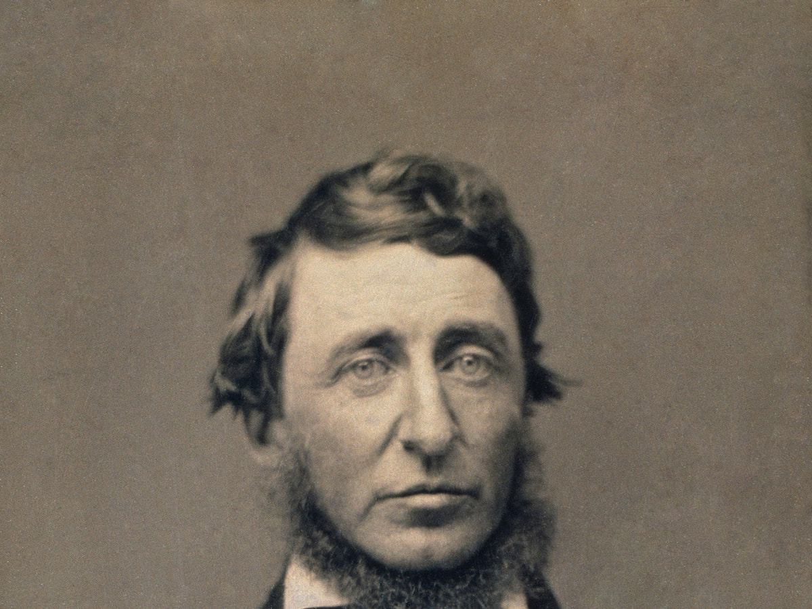
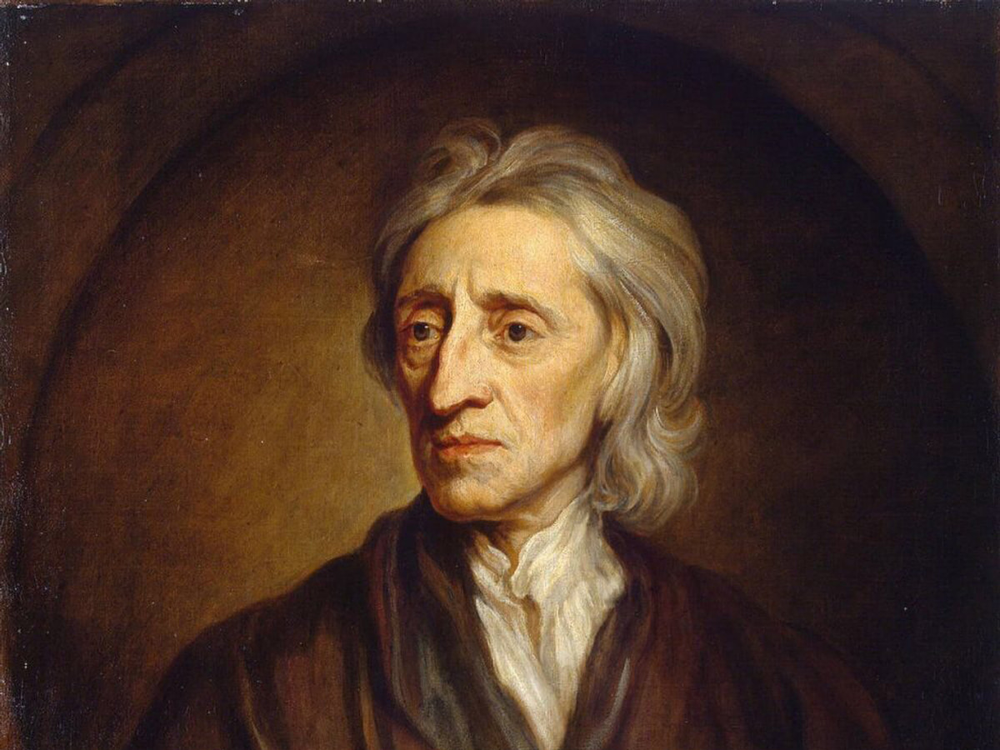

## Today

- Values of the Founding
- Spectrum of limits on government force
- Top Hat: placement and core claims

# Why This Matters

## Why This Matters

::: {.custom-style style="font-size: 55px;"}
By the end of today you will place the Founding on a spectrum of answers to “how much should we limit government?” — and state two modern classical-liberal restatements.
:::

## Bridge

- Government = organized coercive force accepted as legitimate
- Ethics of when force is acceptable
- → Founding values: how to live together peacefully as dignified equals

## Problems of the Founding

::: {.custom-style style="font-size: 55px;"}
We will get to the problems.  
Today: how the *thinking* aims at the core problem.
:::

# Two Questions

## Two basic questions

1. What is the proper purpose of government?
2. How do we limit government to only those purposes?

## Purpose → powers

::: {.custom-style style="font-size: 60px;"}
Lists of powers (especially legislative)
:::

## Limits → structure

::: {.custom-style style="font-size: 55px;"}
Separation of powers, checks, federalism, rights — next lectures
:::

# Ancient Forerunner

## Aristotle

::: {.custom-style style="font-size: 70px;"}
True vs. despotic forms
:::

## Aristotle’s test

::: {.custom-style style="font-size: 55px;"}
Rule for the common good — or for the rulers’ interest?
:::

## Aristotle: True vs Despotic Forms

{width="100%"}

# Classical Liberalism

## Classical liberalism

::: {.custom-style style="font-size: 55px;"}
Enlightenment answer — not today’s party labels
:::

## Classical liberalism

- Limit the power of government
- Expand political participation
- Allow individuals and voluntary associations to flourish

## Modern restatement — Coyne

::: {.custom-style style="font-size: 50px;"}
Live together peacefully in a society of dignified equals
:::

(close paraphrase of Chris Coyne)

## Modern restatement — fulfillment

::: {.custom-style style="font-size: 50px;"}
Empowering individuals to pursue their own fulfillment
:::

## Fulfillment ≠ cheap thrills

::: {.custom-style style="font-size: 50px;"}
Highest purpose — not momentary pleasure
:::

# Legitimate Goals

## Legitimate goals of government

::: {.custom-style style="font-size: 80px;"}
Life
:::

## Legitimate goals of government

::: {.custom-style style="font-size: 80px;"}
Liberty
:::

## Legitimate goals of government

::: {.custom-style style="font-size: 70px;"}
Pursuit of happiness
:::

## Legitimate goals of government

::: {.custom-style style="font-size: 55px;"}
Property — product of labor = product of life and liberty
:::

# Spectrum of Limits

## How much limit?

{width="100%"}

## Most restrained

:::: {.columns}
::: {.column width="35%"}
{width="100%"}
:::
::: {.column width="65%"}
::: {.custom-style style="font-size: 42px;"}
“That government is best which governs not at all.”
:::

— Henry David Thoreau, *Civil Disobedience* (1849)
:::
::::

## Pacifism / non-aggression

::: {.custom-style style="font-size: 55px;"}
Violence never legitimate — or only in defense of life, liberty, property
:::

## Moderate restraint

::: {.custom-style style="font-size: 50px;"}
“That government is best which governs least.”
:::

— *United States Magazine and Democratic Review*

## Krauthammer

::: {.custom-style style="font-size: 48px;"}
“…the mark of a civilized society [is] to maintain organized violence at the lowest possible level…”
:::

— Charles Krauthammer, *Things That Matter* (2013)

## Constitutional limits

::: {.custom-style style="font-size: 55px;"}
Force only when and how a constitution allows
:::

## Social contract (visual)

{width="90%"}

## The bargain

| The people agree to… | The government agrees to… |
|----------------------|---------------------------|
| Give up some freedom | Protect fundamental rights |
| Submit to some coercion | Life · Liberty · Property |

## Social contract — names

:::: {.columns}
::: {.column width="35%"}
{width="100%"}
:::
::: {.column width="65%"}
::: {.custom-style style="font-size: 48px;"}
Hobbes · Locke · Rousseau — different bargains
:::
:::
::::

# Hard Cases

## Militant democracy

::: {.custom-style style="font-size: 50px;"}
Suppress political opponents labeled as threats to democracy
:::

## Realpolitik / pragmatic statecraft

::: {.custom-style style="font-size: 50px;"}
Results and national interest over ideal limits
:::

## Placement (Top Hat poll)

Where would you place **militant democracy** and **realpolitik** on the spectrum — closer to freedom, or closer to theocracy / totalitarianism?

## Theocracy

::: {.custom-style style="font-size: 55px;"}
Power justified by divine mandate
:::

## Totalitarianism

::: {.custom-style style="font-size: 48px;"}
“All within the state, nothing against the state, nothing outside the state.”
:::

— Benito Mussolini

## Totalitarianism

::: {.custom-style style="font-size: 48px;"}
“Ideas are more powerful than guns. We would not let our enemies have guns, why should we let them have ideas.”
:::

— Joseph Stalin

# Teaser

## Is the contract valid?

::: {.custom-style style="font-size: 55px;"}
If you never signed it, are you bound by its terms?
:::

## Later

::: {.custom-style style="font-size: 55px;"}
We return to that question — and to problems of the Founding — in a later lecture.
:::

---

# Top Hat — text bank (remove or hide for live deck)

## Text bank: Founding values and limits

Government is organized coercive force accepted as legitimate. Ethics of force plus that definition lead to Founding values aimed at living together peacefully as dignified equals. Classical liberalism (not modern party labels) emphasizes limiting government power, expanding participation, and allowing individuals and voluntary associations to flourish. Two modern restatements: (1) live together peacefully in a society of dignified equals (Coyne paraphrase); (2) empowering individuals to pursue their own fulfillment (highest purpose, not cheap thrills). Legitimate goals include life, liberty, pursuit of happiness, and property as product of labor. Limits on force form a spectrum from Thoreau (“governs not at all”) and non-aggression, through “governs least” and Krauthammer’s lowest possible organized violence, constitutional limits, and social-contract ideas (Hobbes, Locke, Rousseau), to theocracy and totalitarianism. Militant democracy and realpolitik are hard cases for placement on that spectrum. A later lecture returns to flaws of the Founding and whether a contract you never signed binds you.

## Top Hat questions (auto-scored)

**T/F:** Classical liberalism in this lecture means the same thing as “liberal” in today’s party politics.  
*Answer: False*

**Multiple choice:** A close paraphrase of Coyne’s modern restatement is that the major problem of government is to allow us to:  
A) Maximize GDP only  
B) Live together peacefully in a society of dignified equals  
C) Win every election  
D) Eliminate all disagreement  
*Answer: B*

**Multiple choice:** “Empowering individuals to pursue their own fulfillment” is presented as a modern restatement of:  
A) Divine right of kings  
B) Classical liberalism’s aim for individuals  
C) Totalitarianism  
D) Party platforms only  
*Answer: B*

**T/F:** Thoreau’s line in this lecture is that government is best which governs not at all.  
*Answer: True*

**Multiple choice:** Krauthammer’s mark of a civilized society is maintaining organized violence at:  
A) The highest possible level  
B) Whatever level wins elections  
C) The lowest possible level  
D) Zero only in wartime  
*Answer: C*

**Multiple answer:** Which appear as ends of the more expansive side of the spectrum in this lecture?  
A) Theocracy  
B) Totalitarianism  
C) Thoreau’s “governs not at all”  
D) Non-aggression principle only  
*Answers: A, B*

**Likert (survey / completion):** Where would you place *militant democracy* on the spectrum from most restrained to most expansive use of force?  
1 = Most restrained … 5 = Most expansive

**Likert (survey / completion):** Where would you place *realpolitik / pragmatic statecraft* on the same spectrum?  
1 = Most restrained … 5 = Most expansive

---

# Next

## Next class (September 9 / 10): Origins of Government

Come ready to connect values → why government arises — and what that implies for limits.

## Reminders

- **Module 0 due September 9, 2026 (ORD)** — book + Top Hat registration; avoid drop

## Authorship and License

Do not submit to Quizlet, Chegg, Coursehero, or similar commercial sites.

- Author: Tom Hanna
- Website: [tomhanna.me](https://tom-hanna.org/)
- License: [CC BY-NC-SA 4.0](http://creativecommons.org/licenses/by-nc-sa/4.0/)

