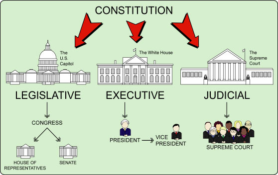
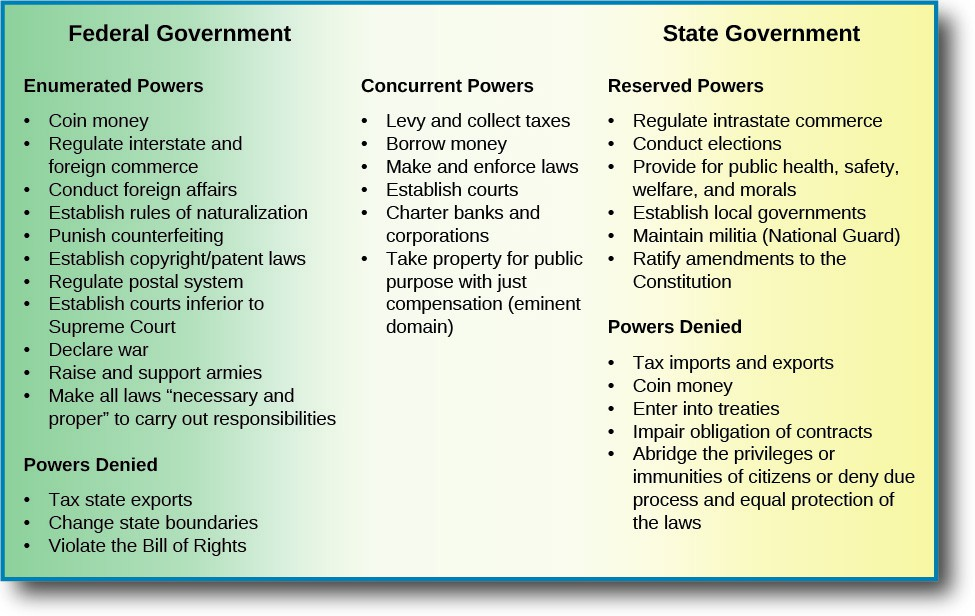

## Today

- Why the Constitution matters
- Separation of powers
- Checks and balances
- Federalism (including who was once independent)
- Top Hat

# Why This Matters

## Why This Matters

::: {.custom-style style="font-size: 55px;"}
By the end of today you will name the main structural tools the Constitution uses to limit organized coercive force — and why splitting power is the point.
:::

## Bridge

- Force is dangerous (Lectures 2–3)
- Values aim at peaceful equals (Lecture 4)
- Origins: force appears for order and rights (Lecture 5)
- Today: *how* the Constitution tries to keep that force limited

## Why care about the Constitution?

::: {.custom-style style="font-size: 50px;"}
A system designed to allow the good and limit the bad from coercive power
:::

## Design tools

- Separation of powers
- Checks and balances
- Federalism
- (Later) Bill of Rights

# Separation and Checks

## Separation of powers

{width="90%"}

## Split power

::: {.custom-style style="font-size: 55px;"}
Separate power among groups with different agendas
:::

## Balance and check

::: {.custom-style style="font-size: 55px;"}
Competing interests force groups to check each other
:::

## Checks and balances

{width="90%"}

## No one dominates alone

::: {.custom-style style="font-size: 55px;"}
No group or person has enough power to act alone
:::

## Three branches

{width="90%"}

## Basic jobs

- Legislative — makes law
- Executive — executes and governs
- Judicial — interprets and applies

## Congress checks

- Impeach
- Override veto (2/3)
- Structure court jurisdiction

## President checks

- Veto
- Pardon
- Discretion in enforcement

## Courts check

::: {.custom-style style="font-size: 55px;"}
Judicial review — Constitution as supreme law
:::

## Supreme Law

::: {.custom-style style="font-size: 48px;"}
This Constitution … shall be the supreme Law of the Land
:::

— Article VI

# Into Federalism

## Congress itself is split

::: {.custom-style style="font-size: 55px;"}
House and Senate — different terms, constituencies, roles
:::

## Senate and the states

::: {.custom-style style="font-size: 50px;"}
Designed to represent states — bridge into federalism
:::

## States were sovereign

::: {.custom-style style="font-size: 50px;"}
Declaration: free and independent *States* — plural
:::

## Who was actually independent?

::: {.custom-style style="font-size: 48px;"}
Thirteen original states · Vermont · Texas · Hawaii
:::

## The other states

::: {.custom-style style="font-size: 50px;"}
Bought or won in war — still get the federalism bargain
:::

## Why that history matters

::: {.custom-style style="font-size: 50px;"}
Federalism is shaped by places that were real countries first
:::

# Federalism

## National and state power

{width="90%"}

## Reserved powers

::: {.custom-style style="font-size: 50px;"}
Powers not given to the United States remain with the states or the people
:::

## Tenth Amendment

::: {.custom-style style="font-size: 48px;"}
The powers not delegated to the United States … are reserved to the States respectively, or to the people.
:::

## State power in practice

::: {.custom-style style="font-size: 55px;"}
Most ordinary crime · property · contracts · family · intrastate life
:::

## Enumerated national powers

{width="85%"}

## Enumerated means limited

::: {.custom-style style="font-size: 55px;"}
Unless the Constitution grants it, it is not a federal power
:::

---

# Top Hat — text bank (remove or hide for live deck)

## Text bank: Constitutional safeguards

The Constitution is a system designed to allow beneficial uses of coercive power and limit abusive ones. Main structural tools: separation of powers, checks and balances, federalism, and later the Bill of Rights. Separation divides power among groups with different agendas; checks and balances mean competing interests constrain each other so no one dominates alone. Legislative makes law; executive executes; judicial interprets. Congress can impeach, override vetoes, and structure jurisdiction; the President can veto and pardon; courts exercise judicial review under the Constitution as supreme law (Article VI). Congress is itself split (House and Senate). The Senate was designed with state interests in mind. The Declaration spoke of free and independent States (plural). About sixteen polities were actually independent countries before joining the Union (thirteen originals plus Vermont, Texas, Hawaii); other states were acquired by purchase or war but still operate under the federalism bargain shaped by that history. Powers not delegated to the United States are reserved to the states or the people (Tenth Amendment). Most ordinary crime, property, contracts, family law, and intrastate life remain primarily state matters. Enumerated national powers are limited: unless the Constitution grants a power, it is not federal.

## Top Hat questions (auto-scored)

**T/F:** Separation of powers means one branch should hold all major powers for efficiency.  
*Answer: False*

**Multiple choice:** Judicial review is presented as the courts’ main check because:  
A) Article III lists every check in detail  
B) The Constitution is supreme law and courts interpret and apply it  
C) Presidents appoint no judges  
D) Congress cannot impeach  
*Answer: B*

**Multiple choice:** Which were independent countries before joining the United States (as framed in this lecture)?  
A) Only the original thirteen  
B) Thirteen originals plus Vermont, Texas, and Hawaii  
C) Every current state  
D) Only Texas  
*Answer: B*

**T/F:** The Tenth Amendment reserves undelegated powers to the states or the people.  
*Answer: True*

**Multiple answer:** Which are examples of primarily state (reserved) domains in this lecture?  
A) Most ordinary crime  
B) Intrastate contracts and property  
C) Declaring war  
D) Family law  
*Answers: A, B, D*

**Likert (survey / completion):** Which structural safeguard do you personally trust most to limit abuse of power?  
1 = Separation of powers  2 = Checks and balances  3 = Federalism  4 = Bill of Rights (preview)  5 = Unsure

---

# Next

## Next class (September 16 / 17): What’s Missing / Amendments

Come ready to talk about original omissions and how the Constitution has been formally changed.

## Reminders

- Stay current on Module work and Top Hat registration

## Authorship and License

Do not submit to Quizlet, Chegg, Coursehero, or similar commercial sites.

- Author: Tom Hanna
- Website: [tomhanna.me](https://tom-hanna.org/)
- License: [CC BY-NC-SA 4.0](http://creativecommons.org/licenses/by-nc-sa/4.0/)

