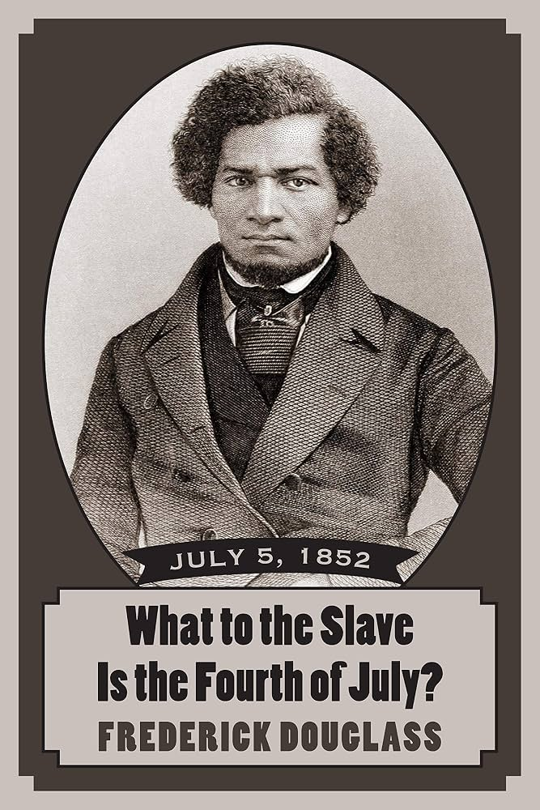

## Today

- The unfinished contract
- What was missing at the Founding
- Civil War and voting amendments
- ERA and the 14th Amendment angle
- Why formal amendment matters
- An open question about consent

# Why This Matters

## Why This Matters

::: {.custom-style style="font-size: 55px;"}
By the end of today you will explain how the original bargain fell short of its own ideals, how formal amendments renegotiated it, and why an unsigned contract still makes rights ethically urgent.
:::

## Bridge

- Government = organized coercive force accepted as legitimate
- Origins and safeguards (Lectures 5–6)
- Today: what the original deal left out — and how the country has tried to rewrite the terms

# The Bargain

## The deal on paper

| The people agree to… | The government agrees to… |
|----------------------|---------------------------|
| Give up some freedom | Protect fundamental rights |
| Submit to some coercion | Life · Liberty · Property |

## Classical liberalism (reminder)

- Limit the power of government
- Expand political participation
- Allow individuals to flourish

## The unfinished contract

{fig-alt="Illustration of a torn or unfinished written contract symbolizing the incomplete original constitutional bargain" width="70%"}

# The Breach

## Biggest flaw by its own ideals?

::: {.custom-style style="font-size: 70px;"}
Slavery
:::

## Antithesis

::: {.custom-style style="font-size: 48px;"}
Slavery was the absolute antithesis of the contract’s promise of liberty and participation for all.
:::

## Excluded from the deal

- Enslaved people — denied rights; treated as property inside the system
- Women — citizens, but locked out of the political side of the bargain
- Limited voting — property, race, gender barriers

## Imperfect by its own standards

::: {.custom-style style="font-size: 55px;"}
America started imperfect by the measure of its own ideals
:::

# Douglass

## Frederick Douglass — 1852

::: {.custom-style style="font-size: 48px;"}
What to the Slave Is the Fourth of July?
:::

## Douglass on the Founders

:::: {.columns}
::: {.column width="35%"}
{fig-alt="Historical portrait of Frederick Douglass" width="100%"}
:::
::: {.column width="65%"}
::: {.custom-style style="font-size: 36px;"}
“I am not wanting in respect for the fathers of this republic… With them, nothing was ‘settled’ that was not right.”
:::
:::
::::

## Douglass’s move

::: {.custom-style style="font-size: 50px;"}
Condemn the breach — and invite the country to live up to its own ideals
:::

# Renegotiating the Terms

## A 200-year renegotiation

::: {.custom-style style="font-size: 55px;"}
Amendments as formal rewrites of the original agreement
:::

## Civil War Amendments

| Year | Amendment | Core change |
|------|-----------|-------------|
| 1865 | 13th | Abolishes slavery |
| 1868 | 14th | Citizenship · equal protection · due process |
| 1870 | 15th | Vote not denied by race |

## Voting and participation

| Year | Amendment | Core change |
|------|-----------|-------------|
| 1913 | 17th | Direct election of Senators |
| 1920 | 19th | Vote not denied by sex |
| 1964 | 24th | No poll tax in federal elections |
| 1971 | 26th | Vote at age 18 |

## Expanding the contract

{fig-alt="Horizontal timeline of constitutional amendments from 1865 to 1971 expanding rights and participation" width="100%"}

## Expanding the circle

{fig-alt="Concentric or growing circles showing expansion of constitutional protection and political participation over time" width="85%"}

# Ink Needs Backup

## Writing it down ≠ making it real

::: {.custom-style style="font-size: 50px;"}
14th Amendment ratified 1868 — sex discrimination under equal protection recognized in 1971
:::

## About 103 years

::: {.custom-style style="font-size: 60px;"}
Ink on parchment is only the first step
:::

## Enforcement statutes

- Civil Rights Act of 1964
- Voting Rights Act of 1965
- Title IX (1972)
- Americans with Disabilities Act (1991)

## Formal amendment still matters

::: {.custom-style style="font-size: 50px;"}
Hard to adopt · hard to repeal · signals near-consensus · binds ordinary politics
:::

## Outside formal amendment (preview)

::: {.custom-style style="font-size: 48px;"}
Statutes · judicial interpretation · political practice — most of this returns in Bill of Rights and Courts lectures
:::

# ERA and the 14th

## Equal Rights Amendment

::: {.custom-style style="font-size: 55px;"}
Attempted — not ratified
:::

## Unfinished renegotiation

::: {.custom-style style="font-size: 50px;"}
Shows how hard formal change is — and that “almost” is not enough
:::

## The 14th Amendment angle

::: {.custom-style style="font-size: 45px;"}
One view: ERA may be unnecessary — and may single women out as a class needing special protection they already have under the 14th
:::

## The counter

::: {.custom-style style="font-size: 48px;"}
The 14th is not explicit on sex — so protection still depends on the goodwill of future Courts
:::

# Consent

## Spooner’s challenge

::: {.custom-style style="font-size: 50px;"}
If you never signed the contract, are you bound by its terms?
:::

## Three steps (open question)

{fig-alt="Three-step flowchart: no personal consent, original signers dead, participation compelled" width="95%"}

## Why that makes rights urgent

::: {.custom-style style="font-size: 48px;"}
If no one really agreed explicitly, respecting basic rights is both an ethical imperative and a practical one
:::

## What else?

::: {.custom-style style="font-size: 50px;"}
What else needs to be done along these same lines — expanding the circle of those protected and those who participate?
:::

# Next

## Next class (September 21 / 22): Bill of Rights, Part 1

Come ready to connect amendments and structure to specific listed rights.

## Reminders

- Module 1 is due September 18, end of day
- Remember late work is 5% off per day automatically, no exceptions

## Authorship and License

Do not submit to Quizlet, Chegg, Coursehero, or similar commercial sites.

| | |
|:---|:---|
| **Author** | Tom Hanna |
| **Website** | [tomhanna.me](https://tom-hanna.org/) |
| **License** | [CC BY-NC-SA 4.0](http://creativecommons.org/licenses/by-nc-sa/4.0/) |

[{fig-alt="Creative Commons Attribution-NonCommercial-ShareAlike 4.0 International License badge"}](http://creativecommons.org/licenses/by-nc-sa/4.0/)
