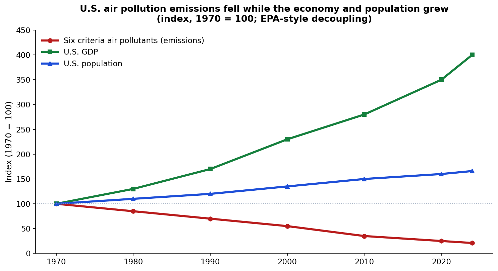

## Today

- Long-run trends in violence, health, and prosperity
- Why the news still feels like permanent crisis
- Why that matters for how we think about government — and about the world

# Why This Matters

## Why This Matters

::: {.custom-style style="font-size: 48px;"}
By the end of today you will explain why long-run declines in violence and rises in health and living standards make a habit of caution before drastic government action rational — even when the news feels like permanent crisis — and why the world (and the United States) are in much better shape than they often seem.
:::

## Bridge

- We have defined government as organized coercive force
- Ethics of when force is justified
- Limits in the founding design and the Bill of Rights
- Today: another reason for long consideration before drastic action

# How It Feels

## The feeling of permanent crisis

::: {.custom-style style="font-size: 55px;"}
Bad news is news — slow improvement is not
:::

## Availability

::: {.custom-style style="font-size: 48px;"}
What is vivid and recent feels more common than it is
:::

# Violence

## Homicide over the long run

{fig-alt="Chart of long-run homicide rates across Western Europe showing large declines from the late Middle Ages to the present" width="95%"}

## Order of magnitude

::: {.custom-style style="font-size: 50px;"}
Medieval rates often 10–40+ per 100,000 — modern Western Europe near 1
:::

# Health

## Life expectancy

{fig-alt="Chart showing global life expectancy rising from around 30 years in 1900 to over 70 years today" width="95%"}

## More than twice as long

::: {.custom-style style="font-size: 50px;"}
Global average ~32 years in 1900 → ~73 years in the 2020s
:::

## Child survival

::: {.custom-style style="font-size: 48px;"}
Pre-modern: large shares of children died before adulthood — every country has improved
:::

# Prosperity

## Extreme poverty — the share

{fig-alt="Line chart showing the share of world population in extreme poverty falling from a large majority historically to around 9 to 10 percent today" width="95%"}

## Despite a much larger world

{fig-alt="Dual-axis chart showing fewer people in extreme poverty even as world population grew substantially" width="95%"}

# Environment (one example)

## Decoupling: pollution vs growth

{fig-alt="Index chart from 1970 showing criteria air pollutant emissions declining while U.S. GDP and population increased" width="95%"}

## Cuyahoga

::: {.custom-style style="font-size: 48px;"}
A river that repeatedly caught fire is now fishable and recreational
:::

*(Then/now photos — place in assets when ready)*

# Optional if time

## Political progress (optional)

::: {.custom-style style="font-size: 48px;"}
Long-run expansion of liberal institutions and individual rights — not utopia, not collapse
:::

# So What

## Progress is not utopia

::: {.custom-style style="font-size: 50px;"}
Remaining problems are real — they are not evidence that the baseline is civilizational collapse
:::

## Better than it often seems

::: {.custom-style style="font-size: 48px;"}
The world, and the United States, are in much better shape on core measures of life, health, and safety than the permanent-crisis narrative suggests
:::

## Habit of caution

::: {.custom-style style="font-size: 48px;"}
When the baseline is historically high peace and prosperity, drastic uses of coercive power still need long consideration
:::

---

# Top Hat — text bank (remove or hide for live deck)

## Text bank: Better Angels

Long-run data show large declines in interpersonal violence (e.g., Western European homicide from high teens–40+ per 100,000 in the late Middle Ages toward ~1 in modern decades), large rises in life expectancy (global average roughly doubling since 1900, from ~32 to ~73 years), and steep falls in the share of the world population in extreme poverty, including periods when absolute numbers of people in extreme poverty fell even as world population grew. U.S. criteria air-pollutant emissions fell on the order of ~79% since 1970 while GDP and population rose substantially — a decoupling pattern. Local examples such as the Cuyahoga River (historically fire-prone, now fishable/recreational) illustrate environmental improvement without requiring a claim of perfection. Availability bias and the news preference for vivid bad events help explain why the permanent-crisis narrative feels true even when base rates improve. Progress is not utopia; remaining problems are real. The policy implication in this course is a habit of caution before drastic uses of coercive power when the baseline is historically high peace and prosperity — and, more broadly, that the world and the United States are in better shape on core life/health/safety measures than the crisis narrative suggests.

## Top Hat questions

**After homicide chart — Likert:** How urgent does interpersonal violence in wealthy countries feel to you relative to the long-run trend just shown?  
1 = Trend is more reassuring than the news … 5 = News urgency feels fully justified

**After life expectancy — Likert:** Same scale for global health / life expectancy.

**After poverty charts — Likert:** Same scale for extreme poverty.

**After decoupling — Likert:** Same scale for U.S. air pollution vs. growth.

**T/F:** Long-run data in this lecture claim that remaining problems no longer matter.  
*Answer: False*

**Multiple choice:** The main course takeaway of this lecture is:  
A) Government should never act  
B) Permanent crisis justifies permanent emergency powers  
C) Historically high baselines of peace and prosperity support caution before drastic coercive action  
D) Progress has ended  
*Answer: C*

**Likert (survey):** Overall, how much does this material shift your sense of whether the world is in permanent crisis?  
1 = Not at all … 5 = A great deal

---

# Next

## Next class: Misinformation

## Reminders

- Stay current on Module work and Top Hat

## Authorship and License

Do not submit to Quizlet, Chegg, Coursehero, or similar commercial sites.

| | |
|:---|:---|
| **Author** | Tom Hanna |
| **Website** | [tomhanna.me](https://tom-hanna.org/) |
| **License** | [CC BY-NC-SA 4.0](http://creativecommons.org/licenses/by-nc-sa/4.0/) |

[{fig-alt="Creative Commons Attribution-NonCommercial-ShareAlike 4.0 International License badge"}](http://creativecommons.org/licenses/by-nc-sa/4.0/)
