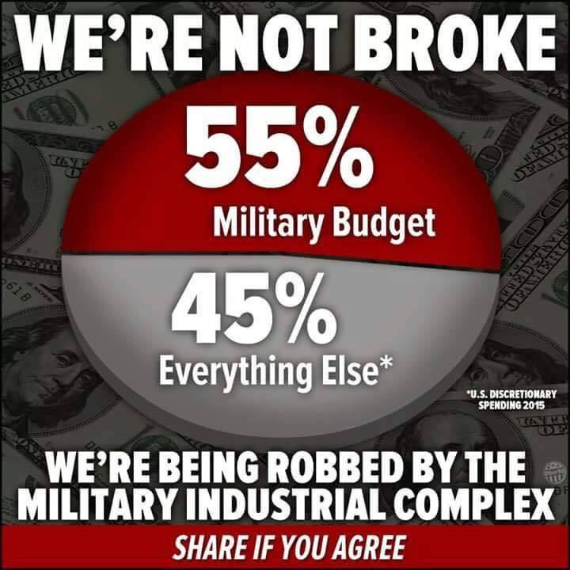
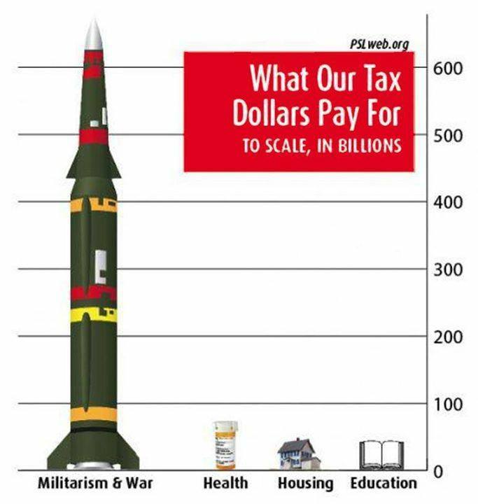
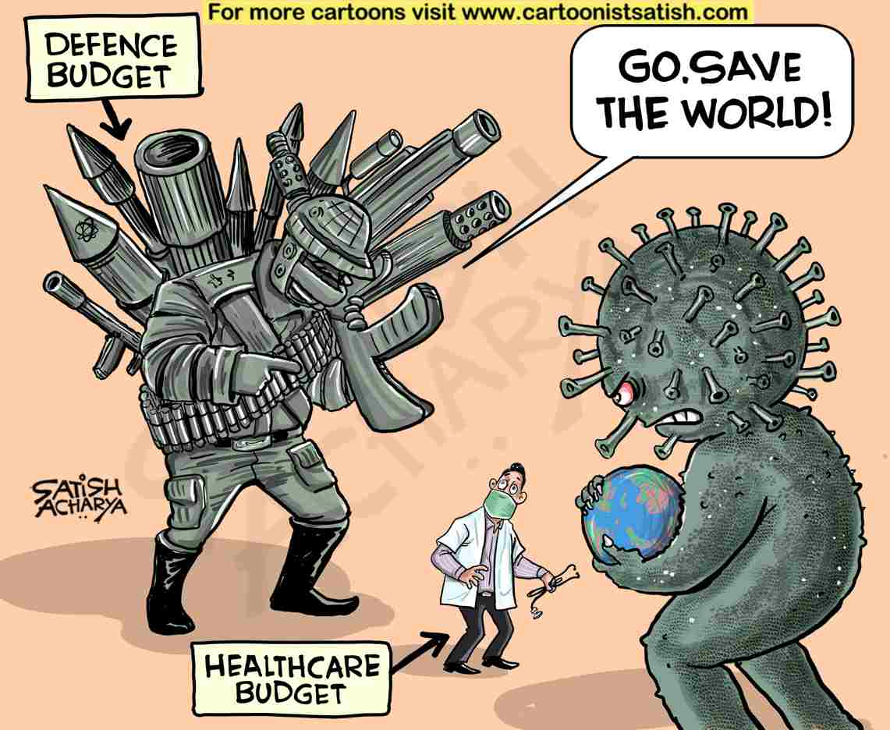
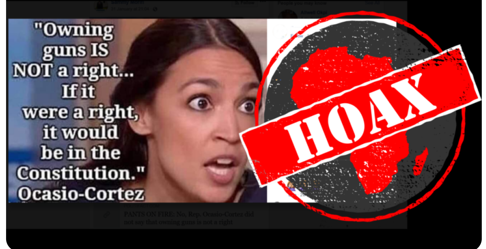
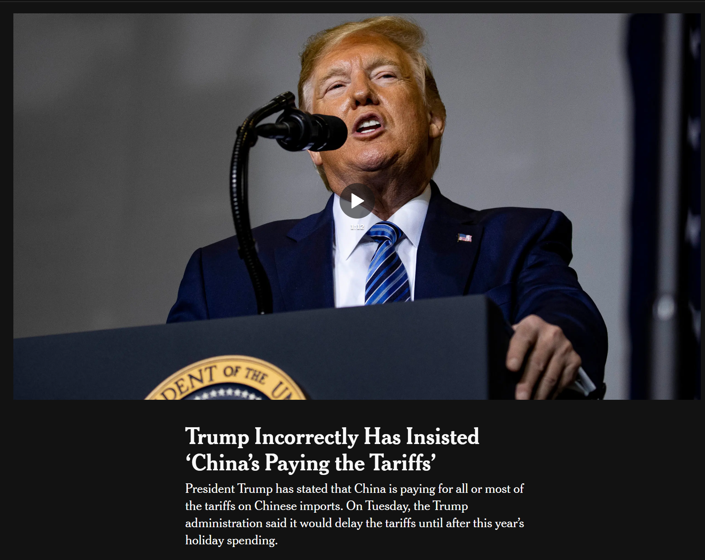
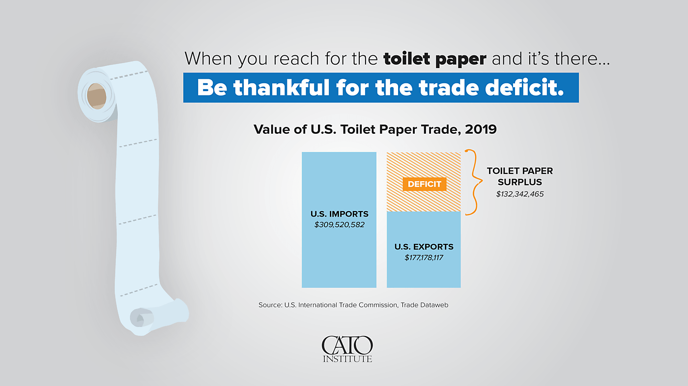
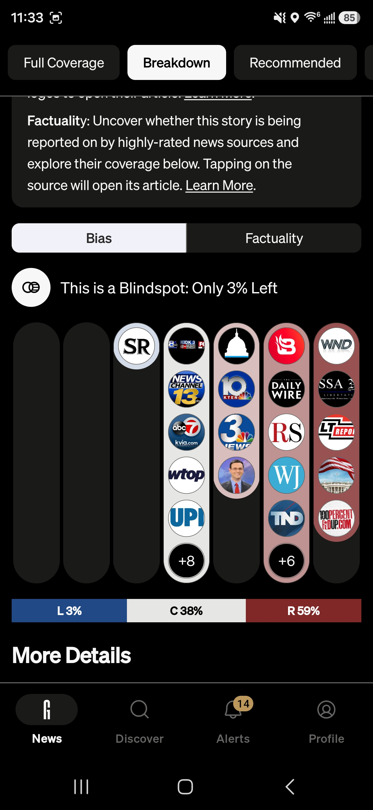

## Today

- Misinformation vs disinformation
- Left-coded budget memes that misuse numbers
- Right-coded fabricated quotes and trade claims
- Why both matter for limiting government wisely
- How to check before you share

# Why This Matters

## Why This Matters

::: {.custom-style style="font-size: 46px;"}
By the end of today you will distinguish misinformation from disinformation, recognize how both left- and right-coded memes misuse numbers or invent quotes, and explain why bad information makes it harder to limit government wisely or to argue honestly for the policies you want.
:::

## Bridge from Better Angels

::: {.custom-style style="font-size: 48px;"}
Vivid claims travel. Slow corrections do not.
:::

## Availability + motivated reasoning

- What is vivid and recent feels more common than it is
- We are quicker to believe what fits our side
- That is why both left- and right-coded falsehoods spread

# Definitions

## Information consumers

::: {.custom-style style="font-size: 52px;"}
Us — the people who receive and act on information
:::

## Misinformation

::: {.custom-style style="font-size: 48px;"}
False or misleading information shared *unknowingly*
:::

## Disinformation

::: {.custom-style style="font-size: 48px;"}
False or misleading information *purposely* created and distributed
:::

## Three kinds of lies

::: {.custom-style style="font-size: 42px;"}
"There are three kinds of lies: lies, damned lies, and statistics."
:::

# Left-coded example: defense budget memes

## 55% of the budget for defense?

{fig-alt="Viral meme claiming about 55 percent of the budget is spent on defense" width="85%"}

## What the meme leaves out

- The 55% figure is for the *discretionary* budget only
- Discretionary is roughly a quarter of the total federal budget
- Almost all defense spending is discretionary
- Almost none of Social Security, Medicare, or most mandatory programs is

## The arithmetic

::: {.custom-style style="font-size: 46px;"}
55% of ~27% ≈ 15% of the total federal budget
:::

## Broader picture

- Add state and local spending and the defense share of *all* government spending is closer to ~8–10%
- Everything else is the large majority

## Same pattern, no footnote

{fig-alt="Pie-chart meme about where tax dollars go that omits mandatory spending context" width="85%"}

## Unusual definitions / missing context

- Discretionary: set in each budget cycle
- Mandatory (nondiscretionary): set by standing law
- Total budget = both

Showing only discretionary makes defense look enormous and other priorities tiny.

## Why someone who wants less defense spending should still care

::: {.custom-style style="font-size: 44px;"}
If the core message is sound, massively misleading numbers still undermine it
:::

## Practical problem

- Bad numbers distract from real trade-offs
- Getting caught with a false meme damages credibility
- Listeners stop trusting the messenger — including on the parts that were true

## Moral problem

::: {.custom-style style="font-size: 48px;"}
Do you want to unknowingly spread disinformation?
:::

## Healthcare vs defense (another common meme)

{fig-alt="Meme comparing defense and healthcare spending in a misleading frame" width="85%"}

## Federal reality (order of magnitude)

- Healthcare (including Medicare) is larger than national defense in the federal budget
- Social Security alone is larger than defense
- Senior benefits (Social Security + Medicare) dwarf defense-related spending

Honest argument > viral pie chart.

# Right-coded example: fabricated quote

## AOC and guns

{fig-alt="Viral meme falsely quoting Alexandria Ocasio-Cortez as saying owning guns is not a right because it would be in the Constitution" width="85%"}

## Status

::: {.custom-style style="font-size: 48px;"}
Fabricated. She did not say this.
:::

## Why it spreads

- Makes a political opponent look ignorant
- Ignores that the Second Amendment exists
- She has said she is a "believer in the Second Amendment" while supporting various restrictions

## Pattern

::: {.custom-style style="font-size: 48px;"}
Same disease, other team: invent the quote that would be convenient
:::

# Right-coded example: trade claims

## "China pays the tariffs"

{fig-alt="Screenshot of a headline about the claim that China pays U.S. tariffs" width="90%"}

## Who actually pays

- Import duties are paid by *U.S. importers* to U.S. Customs
- Costs are largely passed to U.S. buyers
- Foreign governments do not write a check to the Treasury for the tariff

## Trade deficit ≠ "losing money"

{fig-alt="Illustration from a Cato Institute piece showing that a money trade deficit corresponds to a surplus of goods such as toilet paper" width="90%"}

## The idea

- A trade deficit means we imported more goods than we exported
- We received the goods (toilet paper, phones, clothes, parts)
- That is not the same as a business "losing money" with nothing in return

## Parallel to the defense memes

::: {.custom-style style="font-size: 46px;"}
Real policy debate + false or confused framing = worse public argument
:::

# So What

## Not limited by party

- Left-coded: discretionary budget as if it were the whole budget
- Right-coded: invented quotes; tariffs paid by "China"; deficit as pure loss
- Both make honest persuasion harder

## Link to limiting government

::: {.custom-style style="font-size: 46px;"}
Bad information fuels permanent crisis and reckless uses of coercive power — or blocks needed reform with noise
:::

# How to check

## Ground News

{fig-alt="Screenshot of the Ground News app showing left-center-right bias breakdown for a news story" width="40%"}

## What it helps with

- Same story, different outlets
- Bias distribution at a glance
- Blindspots: what one side is not covering

[ground.news](https://ground.news)

## Other simple habits

- Pause before sharing
- Ask: does this number match the *total* or only a slice?
- Ask: is this quote real? Primary source?
- Notice your own side's bias before reacting

## When a friend shares it

::: {.custom-style style="font-size: 46px;"}
Usually private. Show the correction. Do not perform the dunk.
:::

# Next

## Reminders

- **Module 2 due October 9**
- **Midterm: October 12–17 in CASA** — signup opens two weeks before October 12

## Authorship and License

Do not submit to Quizlet, Chegg, Coursehero, or similar commercial sites.

| | |
|:---|:---|
| **Author** | Tom Hanna |
| **Website** | [tomhanna.me](https://tom-hanna.org/) |
| **License** | [CC BY-NC-SA 4.0](http://creativecommons.org/licenses/by-nc-sa/4.0/) |

[{fig-alt="Creative Commons Attribution-NonCommercial-ShareAlike 4.0 International License badge"}](http://creativecommons.org/licenses/by-nc-sa/4.0/)
