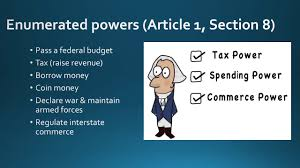
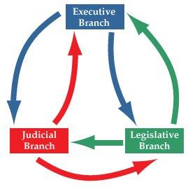
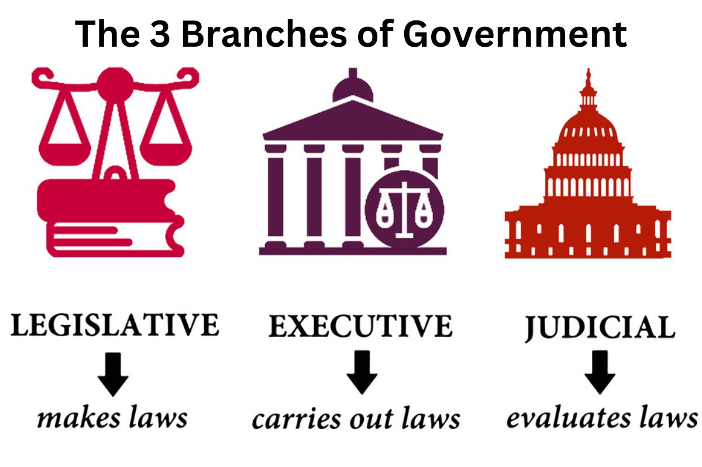

## Today

- Why majority rule still needs limits
- Enumerated and prohibited powers
- Bicameralism, judicial review, and other brakes
- Bill of Rights — especially 9 and 10

# Why This Matters

## Why This Matters

::: {.custom-style style="font-size: 44px;"}
By the end of today you will explain why majority rule still needs limits, what enumerated and prohibited powers do, and how the other branches and the Bill of Rights constrain Congress.
:::

# Why limit Congress?

## Not only kings

::: {.custom-style style="font-size: 48px;"}
A congressional majority can still become tyranny of the majority
:::

## Aristotle's warning

{fig-alt="Aristotle true versus despotic forms of government" width="88%"}

Democracy as rule by the many **for themselves** — not the common good.

## Madison's warning

{fig-alt="Madison contrast of pure democracy and republic" width="90%"}

Majority faction can oppress minorities even under popular forms.

## Crisis mentality

Misinformation and the availability heuristic make problems feel more urgent than long-run trends support.

{fig-alt="Chart of rising life expectancy as a reminder of long-run human progress" width="80%"}

## Even in 1789

::: {.custom-style style="font-size: 46px;"}
Citizens were largely solving their own problems — Congress could still break what was working
:::

# Enumerated powers

## Herein granted

{fig-alt="Diagram or illustration of enumerated powers" width="70%"}

## A list — not a blank check

::: {.custom-style style="font-size: 46px;"}
Congress has the powers the Constitution grants — not whatever a majority wants
:::

## Necessary and Proper

::: {.custom-style style="font-size: 44px;"}
Original understanding: *necessary* and *proper* — not merely convenient or "not too out of line"
:::

# Prohibited powers

## Explicit bans

Article I, Section 9 — categories, not a full catalog:

- **Criminal-process limits:** habeas corpus, bills of attainder, ex post facto laws
- **Anti-aristocracy / anti-corruption:** titles of nobility; foreign emoluments

## Bill of Rights limits Congress

{fig-alt="Visual emphasizing Congress shall make no law from the First Amendment" width="85%"}

## Ninth and Tenth

::: {.custom-style style="font-size: 46px;"}
9th: listing rights does not deny others retained by the people  
10th: powers not delegated are reserved to the states or the people
:::

## Elections

Congress may legislate on federal elections — but the primary presumption is **state** administration. States will resist major federal encroachments.

# Structural brakes

## Bicameralism

::: {.custom-style style="font-size: 46px;"}
Two houses must agree — an internal limit on Congress itself
:::

## Original Senate

State legislatures appointed Senators — a federalism brake on the national legislature (changed by the 17th Amendment).

## Presentment and veto

{fig-alt="Diagram of checks and balances arrows among branches" width="75%"}

Bills go to the President; veto forces a supermajority override.

## Judicial review

::: {.custom-style style="font-size: 46px;"}
Courts can hold acts of Congress unconstitutional — a hard outer limit
:::

(We return to cases and doctrine in the Courts lectures.)

## 27th Amendment

No law varying congressional compensation takes effect until **after** an election of Representatives — a delayed self-deal brake.

# Texas note

## Comptroller and the budget

In Texas, the **Comptroller** certifies available revenue — a practical outer limit on what the Legislature can spend. Same spirit as limited legislative power; different institutional tool.

# Map of limits

## Limits on Congress

{fig-alt="Overview of powers among the three branches" width="85%"}

- Enumerated + prohibited powers
- Bicameralism + original state-appointed Senate
- Veto / presentment
- Judicial review
- Bill of Rights (esp. 9 & 10)
- 27th Amendment

---

# Top Hat — text bank (remove or hide for live deck)

## Text bank: Limiting Congress

Majority rule still needs limits: Aristotle warned that democracy can mean the many ruling for themselves; Madison warned about majority faction. Crisis mentality and misinformation can push Congress to expand power beyond what long-run progress warrants; even in 1789 ordinary problem-solving was largely private. Enumerated powers mean Congress has only what is granted — not a blank check. Necessary and Proper originally meant necessary and proper, not merely convenient. Article I Section 9 bans include criminal-process limits (habeas, attainder, ex post facto) and anti-aristocracy / anti-corruption rules (titles of nobility, foreign emoluments). The Bill of Rights limits Congress; the 9th and 10th protect unenumerated rights and reserve undelegated powers. Elections are primarily a state responsibility. Bicameralism is an internal brake; originally state legislatures appointed Senators. Presentment and veto, judicial review, and the 27th Amendment (pay changes delayed until after an election) further constrain Congress. In Texas, the Comptroller's revenue certification limits legislative spending.

## Top Hat questions

**Enumerated — T/F:** "Enumerated powers" means Congress may exercise only powers granted by the Constitution.  
*Answer: True*

**N&P — MC:** On the original understanding stressed in class, Necessary and Proper means roughly:  
A) Whatever is convenient  
B) Necessary and proper — not merely convenient  
C) Only military powers  
D) Only tax powers  
*Answer: B*

**§9 — MC:** Bills of attainder and ex post facto laws are examples of:  
A) Executive privileges  
B) Criminal-process limits on Congress  
C) State police powers  
D) Treaty powers  
*Answer: B*

**10th — T/F:** The Tenth Amendment reserves powers not delegated to the United States to the states or the people.  
*Answer: True*

**Senate original — MC:** Under the original Constitution, Senators were chosen by:  
A) Popular statewide election only  
B) State legislatures  
C) The President  
D) The Supreme Court  
*Answer: B*

**27th — T/F:** The 27th Amendment delays changes in congressional pay until after an election of Representatives.  
*Answer: True*

**Judicial review — T/F:** Courts can hold acts of Congress unconstitutional.  
*Answer: True*

**Synthesis — Likert:** How strongly do you agree: "Judicial review is necessary to keep Congress within enumerated powers."  
1 = Strongly disagree … 5 = Strongly agree

---

# Next

## This week

- **Midterm: October 12–17 in CASA**
- Class **Monday / Tuesday only** — **no class Wednesday / Thursday**

## After the midterm

Trade-offs and unintended consequences

## Authorship and License

Do not submit to Quizlet, Chegg, Coursehero, or similar commercial sites.

| | |
|:---|:---|
| **Author** | Tom Hanna |
| **Website** | [tomhanna.me](https://tom-hanna.org/) |
| **License** | [CC BY-NC-SA 4.0](http://creativecommons.org/licenses/by-nc-sa/4.0/) |

[{fig-alt="Creative Commons Attribution-NonCommercial-ShareAlike 4.0 International License badge"}](http://creativecommons.org/licenses/by-nc-sa/4.0/)
