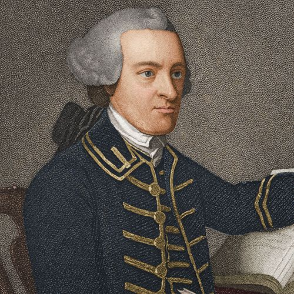
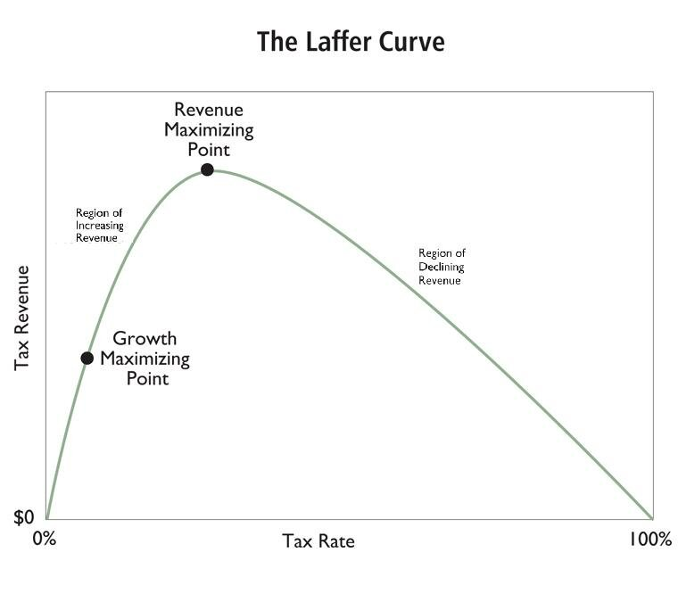

# Trade-offs and Unintended Consequences

## By the end of today

::: {.custom-style style="font-size: 1.6em;"}
You will be able to recognize trade-offs and unintended consequences in public policy and begin to understand why they matter.
:::

## Where this fits

We limit government because:

- It is organized coercive force
- Even good people are not omniscient

Today: the knowledge problem and the trade-offs that follow

## If men were angels

::: {.custom-style style="font-size: 1.5em;"}
"If men were angels, no government would be necessary."  
— Federalist 10 (Madison)
:::

## Even if they were angels

::: {.custom-style style="font-size: 1.6em;"}
Good intentions and incorruptibility are not enough.
:::

Why?

## The knowledge problem

{fig-alt="Diagram showing a single central planner with incomplete information versus many local actors each holding partial knowledge"}

## Trade-offs are everywhere

::: {.custom-style style="font-size: 1.5em;"}
Personal life first.
:::

You have $3.  
Candy bar or soda?

## Every choice has a cost

- Time
- Money
- Attention
- Opportunity

## Government faces the same reality

- Collective choices still involve trade-offs.
- The tool is still coercive force.

## Benefit versus enforcement cost

::: {.custom-style style="font-size: 1.6em;"}
The stated goal is only one side of the ledger.
:::

## John Hancock

{fig-alt="Portrait of John Hancock"}

Smuggler evading British taxes.

## Eric Garner

{fig-alt="Photograph of Eric Garner"}

Killed while selling loose cigarettes to evade high New York taxes.

## Human costs of enforcement

::: {.custom-style style="font-size: 1.7em;"}
Force is never free.
:::

## Unintended consequences

::: {.custom-style style="font-size: 1.5em;"}
Results that were not intended or foreseen.
:::

They are a form of trade-off.

## The cobra effect

{fig-alt="Historical illustration of a government bounty on cobras that led to people breeding cobras"}

## Sin taxes and black markets

{fig-alt="Conceptual image of a black-market exchange under high sin taxes"}

## Other classic cases

- DDT ban → malaria resurgence
- Three-strikes and capital punishment for non-homicide crimes → incentive to eliminate witnesses

## Sometimes unintended consequences are better

::: {.custom-style style="font-size: 1.5em;"}
Sometimes unintended consequences are better than the intended consequences.
:::

## Texas secession vote, 1861

::: {.custom-style style="font-size: 1.5em;"}
Texans voted to secede in order to protect slavery.
:::

## An unintended result

::: {.custom-style style="font-size: 1.5em;"}
The war that followed produced the Emancipation of the slaves in Texas (and the United States).
:::

## Economic trade-offs

::: {.custom-style style="font-size: 1.6em;"}
Tax rates versus revenue and growth.
:::

## The Laffer Curve

{fig-alt="Simple Laffer Curve showing tax rate versus revenue"}

## Inequality and growth — the math

{fig-alt="Side-by-side bars showing starting incomes of $10 and $20, then tripled incomes of $30 and $60, with the gap tripling while both sides are better off"}

## Short-term versus long-term

{fig-alt="Visual metaphor of a balance scale or seesaw contrasting immediate benefits with longer-term costs or gains"}

## Concentrated benefits, diffuse costs

{fig-alt="Diagram of concentrated benefits for a few versus diffuse costs for many"}

## The cascade of regulation

{fig-alt="Descending spiral of successive regulations each attempting to fix the problems created by the previous ones"}

## Recap

- Even good people face a knowledge problem
- Every policy involves trade-offs
- Unintended consequences are part of those trade-offs
- Enforcement itself carries human costs
- We limit government for these reasons as well

## Top Hat

- T/F and multiple-choice items on the knowledge problem, trade-offs, and unintended consequences
- Likert: “When evaluating a new policy I should focus mainly on the problem it claims to solve.”
- Short text-bank prompts available for AI question generation if needed

## Next

::: {.custom-style style="font-size: 1.5em;"}
The Executive — Defender and Despoiler of Rights
:::

## Reminders

- **Module 3 due November 6**
- Midterm window (October 12–17) is closed
- Next class: Executive lecture (October 21 / 22)

## Authorship and License

Author: Tom Hanna  
Website: [tomhanna.me](https://tomhanna.me)  

This work is licensed under a [Creative Commons Attribution-NonCommercial-ShareAlike 4.0 International License](http://creativecommons.org/licenses/by-nc-sa/4.0/).

