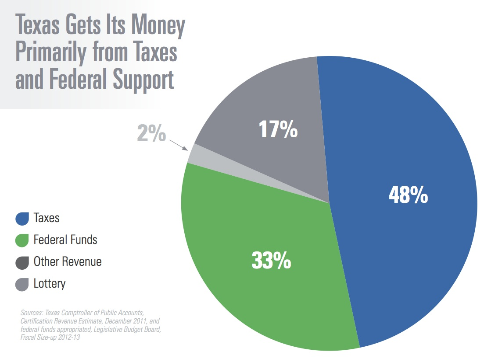

# Texas Policies

## By the end of today

::: {.custom-style style="font-size: 1.6em;"}
You will be able to explain why Texas writes so much ordinary policy into its constitution, and what incentives that creates.
:::

## Where this fits

Lecture 9: Texas is two articles behind, and the document is long because residual power sits here.

Today: what that looks like in policy.

## The book does the catalog

Oil and gas. Water. Education. Criminal justice. Welfare. Taxation.

This hour is the incentive structure, not the whole codebook.

## Constitutionalized policy

::: {.custom-style style="font-size: 1.6em;"}
Homestead protection and the ban on a state income tax are not statutes. They are hard to move.
:::

## Why write policy into the rules?

Suspicion of the next legislature.

A short biennial session.

A habit of taking fights out of ordinary politics.

## The trade-off

::: {.custom-style style="font-size: 1.5em;"}
Hard rules protect a settlement. They also freeze yesterday's bargain.
:::

That is Constitution Making in a state key.

## Energy and the Railroad Commission

{fig-alt="Diagram of the Texas plural executive including specialized commissions" width="75%"}

Insulated economic administration — not a second Federal Reserve.

## Education as a federalism tell

Schools are a core state job.

Much modern federal education activity is, at best, extra-constitutional.

## Revenue without an income tax

{fig-alt="Chart of Texas state revenue sources" width="75%"}

The mix is a choice with winners, losers, and volatility.

## Catch-up

Use leftover minutes for Module questions, cases leftovers, or the next toolkit preview.

Do not invent a second lecture if the room needs review.

## Recap

- Texas puts some ordinary policy in the rulebook on purpose
- That is a brake and a freeze
- Specialized commissions and no income tax are the local illustrations
- The book still owes you the detail

## Top Hat

- T/F: Texas's prohibition on a state income tax is ordinary statute and can be repealed by simple majority in one session.
- MC: Writing policy into a state constitution is closest to:
- Likert: "I would rather have more policy in the Texas Constitution, not less."

## Next

::: {.custom-style style="font-size: 1.6em;"}
Direct Action — the citizen toolkit
:::

## Reminders

- Next class: Direct Action (November 18 / 19)
- Then Thanksgiving; Ethics of the Citizen is November 30 / December 1

## Authorship and License

Author: Tom Hanna  
Website: [tomhanna.me](https://tomhanna.me)

This work is licensed under a [Creative Commons Attribution-NonCommercial-ShareAlike 4.0 International License](http://creativecommons.org/licenses/by-nc-sa/4.0/).

